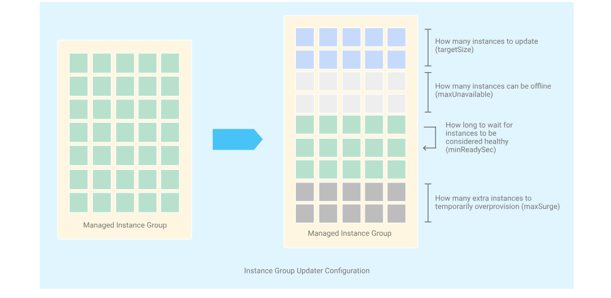
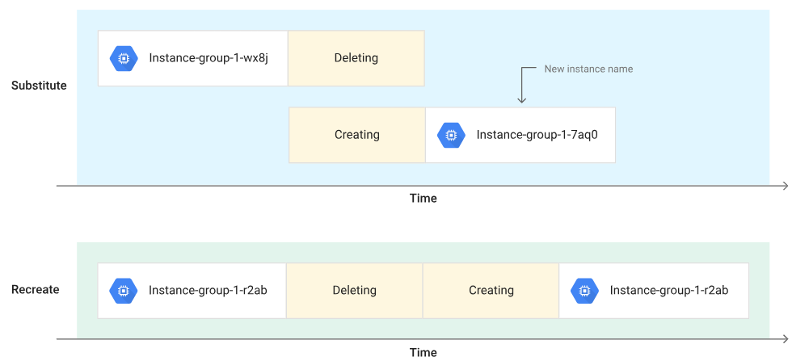

## Instance Groups

Oggetto che consente di creare un gruppo di VMs, gestite come singola entità

Due tipologie:
- **Managed**: VMs identiche create usando un template (MIG)
    - Features: autoscaling, auto healing, managed releases
    
    
- **Unmanaged**: VMs differenti
    - Non offrono le features del MIG

    

    

Entrambe le due tipologie possono essere Zonal or Regional, posso creare nella stessa Zone, in Zones diverse, in Regions diverse (HA)

Vediamo le due tipologie nel dettaglio

### Managed Instance Gruops (MIG)
- **Identiche VMs** create usando lo stesso instance template
- Caratteristiche principali:
    - avere un **certo numero stabilito di instanze** -> se una fallisce viene ricreata
    - **rilevare fallimenti**, usando health checks (auto healing), **e sopperire** ad essi
    - aumentare o diminuire il numero di instanze in base al carico (**auto scaling**)
    - aggiungere un **Load Balancer per distribuire il carico**
    - creare le **istanze in Zones diverse**, o nella stessa zone. 
    - rilascio di **nuove versioni senza downtime**
        - **rolling updates**: rilascio nuova versione step-by-step. Gradualmente ne aggiorno una, poi un'altra ecc
        - **canary deployment**: testo una nuova versione su un gruppo ristretto di istanze prima di farlo sul gruppo intero (canarino miniere)

    (Regional MIGs >> Zonal MIGs, in termini di HA)  Il nome potrebbe ingannare  

    Zonal MIG -> singola zona

    Regional MIG -> diverse zone ma nella stessa Region 

  ## Entrando più in dettaglio sugli aggiornamenti in sequenza (rolling updates)
    
    Aggiornamento che viene applicato gradualmente a tutte le istanze di un MIG, fino a quando tutte non sono state aggiornate. Passare da una versione che potrebbe riferirsi ad una vecchia versione dell'applicazione ad una che si rifà ad una nuova versione 
    
    E' possibile controllare molti aspetti, ad esempio **quante istanze possono essere rese offline durante l'aggiornamento**, quanto **tempo di attesa** tra un aggiornamento delle istanze, se il nuovo template interessa **tutte le istanze o solo alcune** ecc. Vedremo in dettaglio cosa significa

    Occorre ricordare che:
    - *Occorre controllare lo stato del gruppo per determinare se il deployment dell'aggiornamento è stato eseguito correttamente*. 
    - *E' possibile specificare due versioni di template per il MIG, questo consente di eseguire canary updates*.

    Opzioni per l'aggiornamento:
    - Update type:
        - Automatic, (proattivo). 
        - Selective, (opportunistico), quando manualmente attivato o quando nuove istanze vengono create. 

    - Maximum surge
        - Rappresenta il numero di istanze che posso creare sopra il targetSize, durante un aggiornamento. (costo istanze in più anche se temporanee)

    - MaxUnavailable 
        - Rappresenta il numero massimo di istanze non disponibili durante l'aggiornamento. Ho 10 istanze e due possono stare offline, due verranno aggiornate e le restanti 8 serviranno a servire le richieste, per poi passare alle successive

    *Note: If you set both maxSurge and maxUnavailable properties and both properties resolve to 0, the Updater automatically sets maxUnavailable=1, to ensure that the automated update can always proceed.*
    - MinReadSec (potrebbe essere deprecata)
        - Tempo di attesa prima di considerare una nuova/restart istanza come aggiornata. 

Di default, quanto l'aggiornamento di un MIG è proattivo, le istanze vecchie vengono eliminate e sosituite con le nuove, ed i nuovi nomi. Spesso è utile mantenere il nome delle istanze.

 Per preservare il nome delle istanze:

-   Scegliere RECREATE anzichè SUBSTITUTE, se utilizzo gcloud CLI
-   Flag Keep instance names when replacing instances, se lo faccio da console

## Demo Rolling update
1.  In the Google Cloud console, go to the Instance groups page.

2. Go to Instance groups

3. Select the MIG that you want to update.

4. Click Update VMs.

5. Under New template, click the drop-down list and select the new template to update to. The target size is automatically set to 100%, indicating that all your instances will be updated.

6. Under Update configuration, expand the selection menu and select **Automatic** as the Update type (Proattiva). Leave default values for the other options.

7. Click Update VMs to start the update.

Se non specidicato diversamente nel punto 6. il maxSurge e il maxUnavailable sono settati ad 1. Questo significa che solo 1 istanza può rimenere offline in ogni Zone, e può essere creata 1 sola istanza in aggiunta durante l'aggiornamento in ogni Zone. 

[Documentazione ufficiale all'aggiornamento MIG e demo di esempio ](https://cloud.google.com/compute/docs/instance-groups/rolling-out-updates-to-managed-instance-groups#console)

### Canary updates

Un aggiornamento canary è un aggiornamento applicato a un sottoinsieme di istanze del gruppo. Con un aggiornamento canary, puoi testare nuove funzionalità o upgrade su un sottoinsieme casuale di istanze, anziché implementare un aggiornamento potenzialmente fastidioso per tutte le tue istanze. Se un aggiornamento non va a buon fine, devi solo eseguire il rollback del sottoinsieme di istanze, riducendo al minimo l'interruzione per i tuoi utenti.

Un aggiornamento canary è uguale a un aggiornamento in sequenza standard, tranne per il fatto che il numero di istanze da aggiornare è inferiore alla dimensione totale del gruppo di istanze. Come un aggiornamento in sequenza standard, puoi configurare opzioni aggiuntive per controllare il livello di interruzione del servizio.

Avvio di un aggiornamento canary

Per avviare un aggiornamento canary, specifica fino a due versioni del modello di istanza, in genere un nuovo modello di istanza per la versione canary e l'attuale modello di istanza per il resto delle istanze.

Devi sempre specificare una dimensione di destinazione (targetSize) per la versione canary. Non puoi avviare un aggiornamento canary se ometti la dimensione di destinazione per la versione canary. Ad esempio, se hai specificato che deve essere utilizzato il 10% delle istanze per il canary, il restante 90% non è stato modificato e utilizza il modello di istanza corrente.

## Demo canary update
1. Nella console Google Cloud, vai alla pagina Instance groups.

2. Seleziona il gruppo di istanze gestite (MIG) che vuoi aggiornare.
3. Fai clic su Update VMs.
4. Fai clic su Add a second template e scegli il nuovo template di istanza per canary.
5. In Target size, inserisci la percentuale o il numero fisso di istanze che vuoi utilizzare per canary del nuovo modello di istanza.
6. Se vuoi, puoi configurare altre opzioni di aggiornamento.
7. Fai clic su Update VMs per avviare l'aggiornamento.

Per ulteriori opzioni, vedi Configuring options for your update.

Dopo aver effettuato una richiesta, puoi monitorare l'aggiornamento per sapere quando è terminato.

### Implementazione di un aggiornamento canary

Dopo aver eseguito un aggiornamento canary, puoi decidere se eseguire il commit dell'aggiornamento sul 100% del gruppo di istanze gestite o eseguirne il rollback.

1. Nella console Google Cloud, vai alla pagina Instance groups.

2. Seleziona il gruppo di istanze gestite (MIG) che vuoi aggiornare.
3. Fai clic su Update VMs.ze

4. In New template, aggiorna il target size del modello canary impostandole su 100% per trasferire il modello a tutte le istanze. In alternativa, puoi sostituire il modello principale con quello canary, rimuovendo il campo del secondo template.
5. Fai clic su Update VMs per avviare l'aggiornamento.

## Rolling replace o restart

Un rolling restart stoppa e fa ripartire tutte le istanze, mentre un rolling replace rimpiazza le istanze (substitute/recreate sono sinonimi). Un rolling restart o replace non cambia altro sul gruppo, incluso template instance (stesso modello).

Ci sono molte ragioni per realizzarlo:

- Eliminare buchi di memoria.
- Restart della tua applicazione per farla ripartire su di una macchina nuova
- Rimpiazzo come best practise
- Aggiornamento del sistema operativo o far rieseguire start script per aggiornare il software

E' possibile eseguirlo tramite Google Cloud console, the Google Cloud CLI, o Compute Engine API.

Anche in questo caso sono presenti le opzioni di Maximum surge, maximum unavailable e what you want to do (restart/replace)

1. Nella console, vai su Instance groups.

2. Seleziona il MIG sul quale  si desidera riavviare o sostituire le VMs 
3. Click Restart/replace VMs.
4. Sotto la voce Operation, seleziona *Restart or Replace*.
   
    4.1  Se selezioni *Restart*:

        - Maximum unavailable instances 
        - Minimum wait time
    4.2  Se selezioni *Replace*:

        - Scegli se mantenere i nomi delle istanze quando replicati
        - Temporary additional instances (maxSurge)
        - Maximum unavailable instances (maxUnavailable)
        - Minimum wait time 
5. Per eseguire l'operazione Restart VMs o Replace VMs.